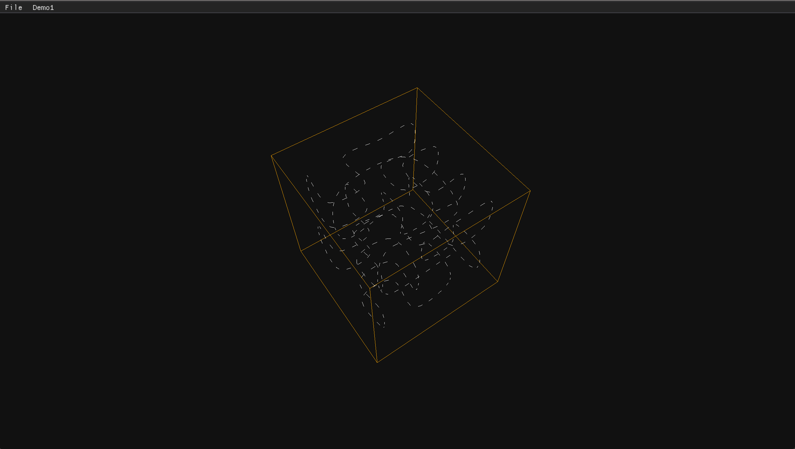
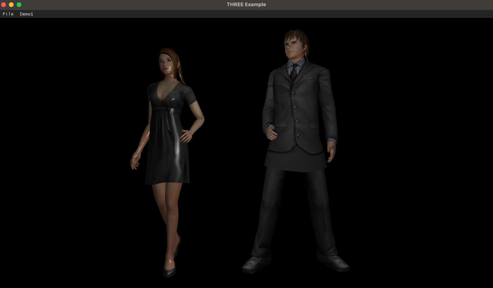
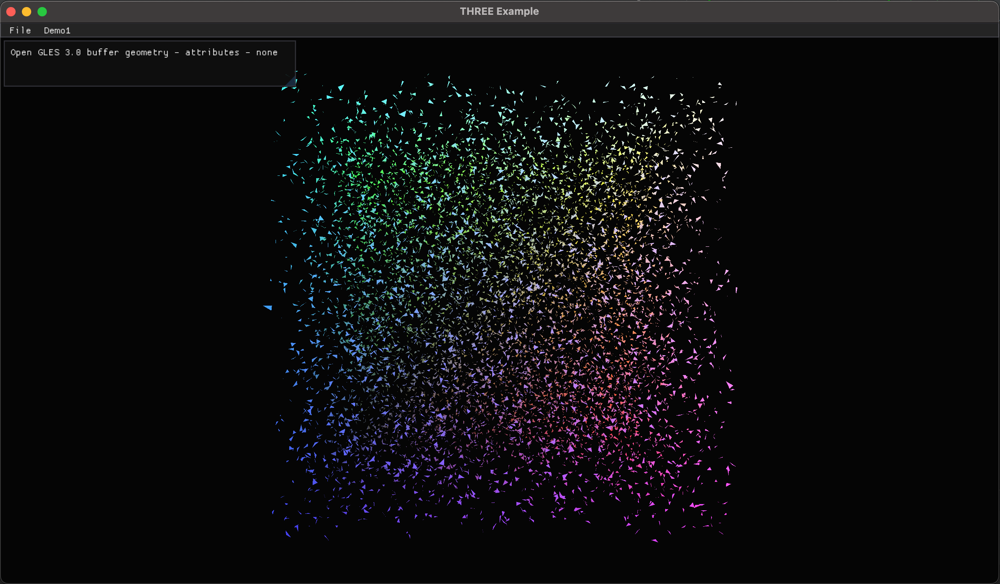

# three.cpp
 a clone cpp graphics library inspired by three.js.

## Basic Running Environment
 I pick google's angle as a direct replacement for WebGL which three.js depends on,hence, I can concentrate on computer graphics itself.
 
 Now I first run it on MacOS Apple Silicon and Windows desktop with angle by libEGL + libGLESv2.

## Three.cpp 基于three.js的cpp跨平台本地渲染框架

有感于three.js基于图形学的知识在web上几乎从头开始搭建了一个优秀的图形学框架，并且提供了无数的精彩例子。[three.pp](https://github.com/nintymiles/three.cpp)，基于google angle实现，以three.js为蓝本，使用cpp语言学习实现跨平台的本地渲染框架，目前已经实现的功能：

- [x] 完成渲染引擎部分功能的移植
- [x] 基于MacOS Apple Silicon平台的运行
- [x] 基于win64 系统的运行
- [x] 实现了2个线段绘制例子
- [x] 迁移了obj/mtl loader，实现了obj/mtl解析加载功能，并实现一个例子
- [x] 实现了一个buffer geometry，无顶点数据绘制例子

## Demos

| Name                                | Desc                                                                               |
|:------------------------------------|:-----------------------------------------------------------------------------------|
| Lines                               |                                                                                    |
| [Lines-Sphere]()                    |                     |
| [Lines-Dashed]()                    |                     |
| Loader                              |                                                                                    |
| [Obj-Mtl-Loading]()                 |                   |
| Buffer Geometry                     |                                                                                    |
| [Buffer-geometry-attributes-none]() |  |

