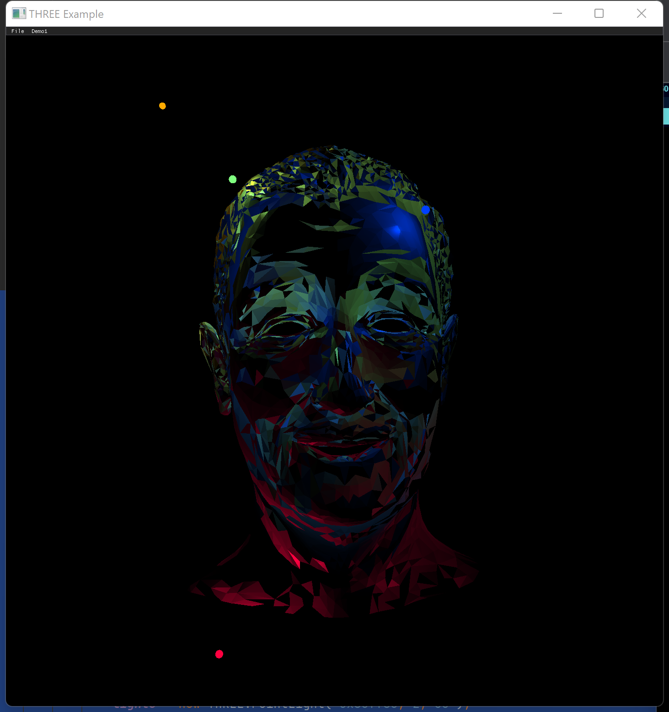

# three.cpp
 a clone cpp graphics library inspired by three.js.

## Basic Running Environment
 I pick google's angle as a direct replacement for WebGL which three.js depends on,hence, I can concentrate on computer graphics itself.
 
 Now I first run it on Mac OS arm 64 and Windows desktop with angle by libEGL + libGLESv2.

## Demos

| Name                                | Desc                                                                               |
|:------------------------------------|:-----------------------------------------------------------------------------------|
| Lines                               |                                                                                    |
| [Lines-Sphere]()                    |                     |
| [Lines-Dashed]()                    |                     |
| Loader                              |                                                                                    |
| [Obj-Mtl-Loading]()                 |                   |
| Buffer Geometry                     |                                                                                    |
| [Buffer-geometry-attributes-none]() |  |
| Lights                              |                                                                                    |
| [Lights-pointLights](),mtl解析有问题！    |  |

