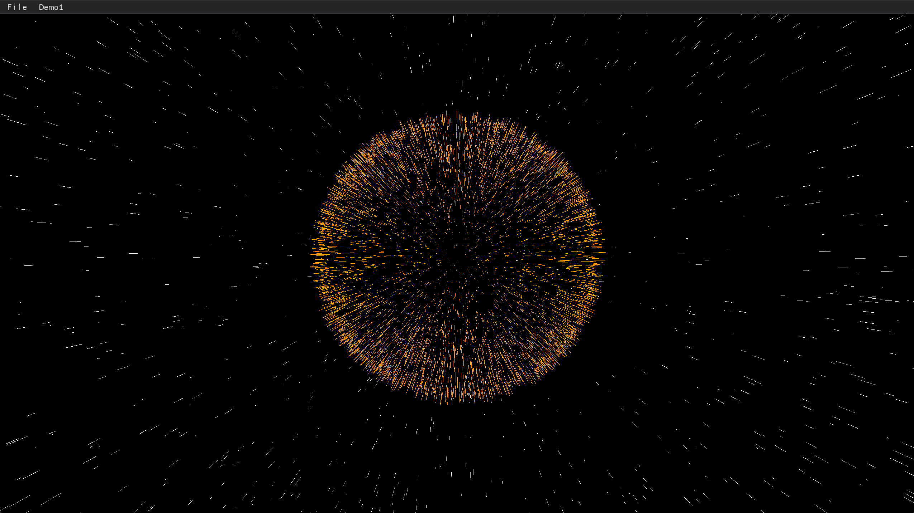

# three.cpp
 a clone cpp graphics library inspired by three.js.

## Basic Running Environment
 I pick google's angle as a direct replacement for WebGL which three.js depends on,hence, I can concentrate on computer graphics itself.
 
 Now I first run it on Mac OS arm 64 and Windows desktop with angle by libEGL + libGLESv2.

## Demos

| Name             | Desc                                                                      |
|:-----------------|:--------------------------------------------------------------------------|
| [Lines-Sphere]() |  |
| [Lines-Dashed]() |  |

