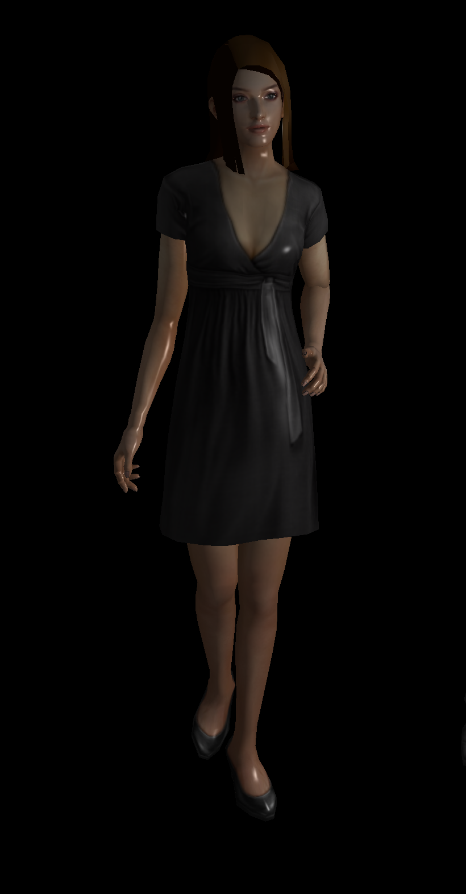
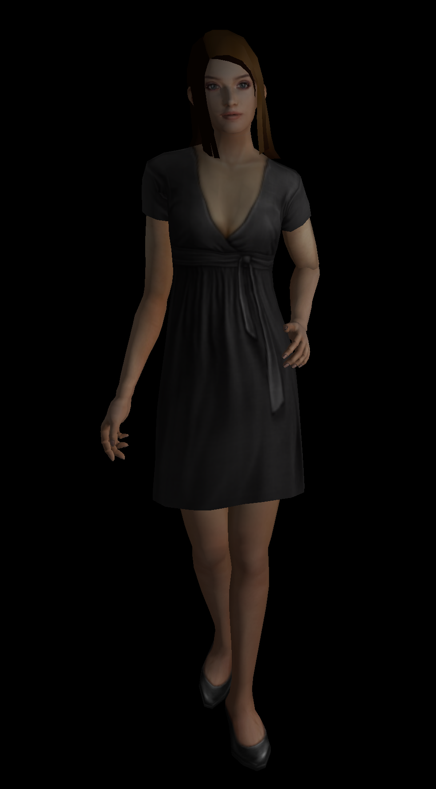
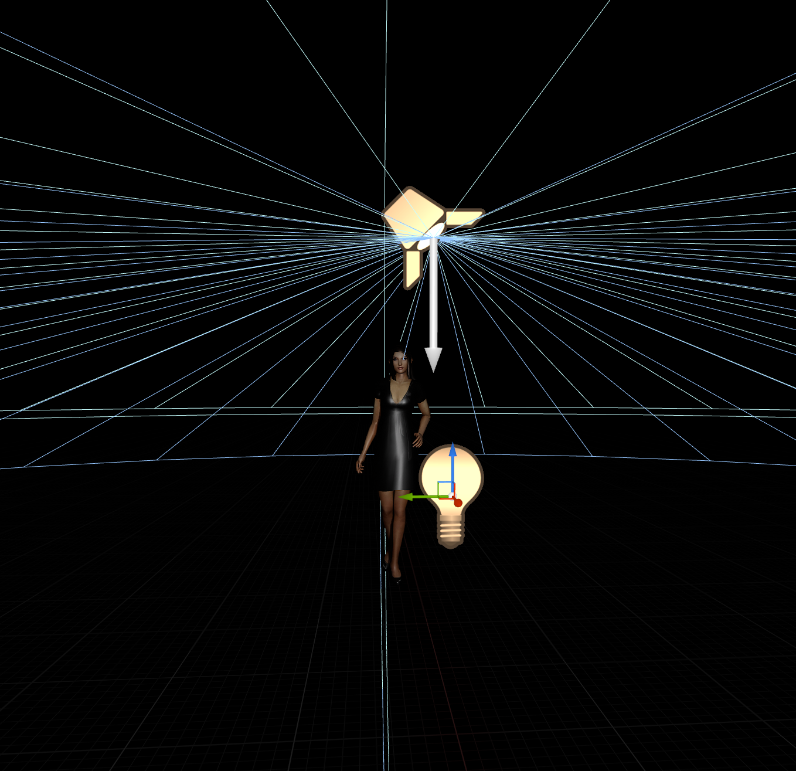
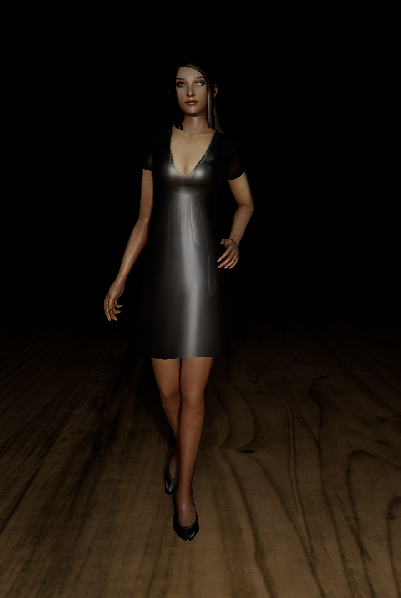

# 使用UE加载Obj模型，并和OpenGL本地程序加载效果对比

## 使用OpenGL程序加载obj模型并渲染
使用three.cpp程序加载obj模型(three.js中的female02.obj模型)，使用three.js的MeshPhongMaterial着色器渲染模型，
three.cpp中渲染光源设置如下：
```cpp
        scene = std::make_shared<Scene>();
        scene->setBackgroundColor(Color().set(0x000000));
        
        //使用一个环绕光源
        auto ambientLight = AmbientLight::create(Color().setHex(0xcccccc),0.8f);
        scene->add(ambientLight);
        
        //再设置一个点光源
        auto pointLight = PointLight::create(Color().setHex(0xffffff),1.0f);
        pointLight->position.set(30, 20, 50);
        pointLight->castShadow = true;
        scene->add(pointLight);
```
实现效果如下：


借助three.js中偏PBR的MeshStandardMaterial着色器来渲染，各有优劣，感觉实际效果还不如上面。可能是参数设置原因，待后续了解后再比较。默认参数效果如下：


具体渲染程序可以从[three.cpp](https://github.com/nintymiles/CGLearning)项目gl_obj_mtl_loader样例中获取。

## 在UE5中加载Obj模型的步骤
在UE5中加载Obj模型有两种方式，一种是使用Blender将Obj模型及对应的mtl材质转换为fbx格式的模型， 然后使用UE的导入功能，在导入选项中选择“合并mesh”选项，这样会将整个Obj模型生成一个几何网格。

注意：在导入选项中选择“合并mesh”选项，否则导入的将是多个局部模型，需要将所有 局部几何模型都导入到UE中才 会形成一个模型整体。这时可能需要在UE中生成一个分组管理整个模型。

另一种方式是直接导入，虽然UE导入类型中没有单列obj类型，但仍然支持直接导入。在导入时在高级中注意选择合并静态mesh，否则obj的各个局部会单独形成几何mesh。

## 在UE5中给模型增加光源，模仿OpenGL程序中的环绕光源和点光源效果
UE中没有环绕光源，使用一个spotlight光源代替，将spotlight的内锥体角度设置为80，外锥体角度设置为85，
模仿环绕光源。再放置一个pointlight点光源。分别将两个光源的强度一个设置为0.8，一个设置为1.0。两个光源的位置近似上面程序的光源位置。如下图：

渲染效果：


## 结果
UE的渲染效果比OpenGL本地程序的要好不少，其物理渲染效果（PBR）更真实，实际上实现过程更加复杂。但是three.js中的着色器
也很不错，相比UE并没有差很多。