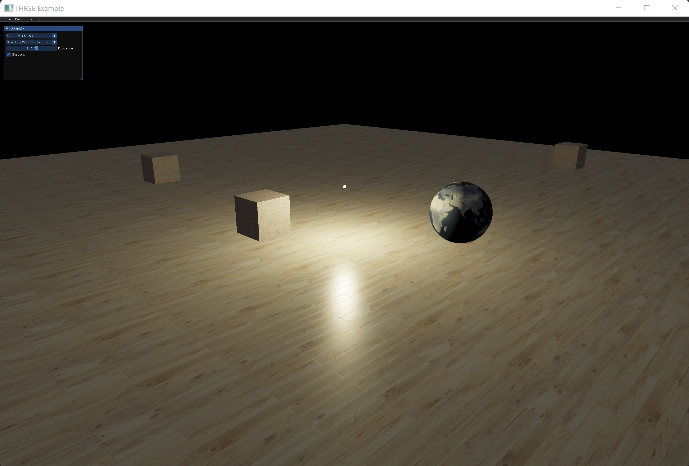
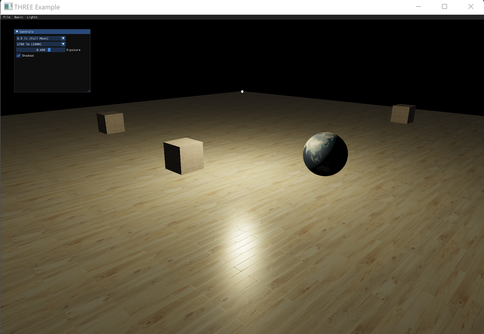
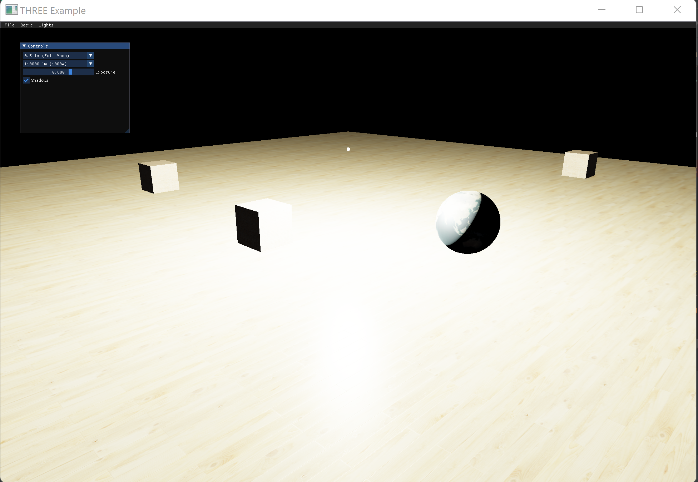
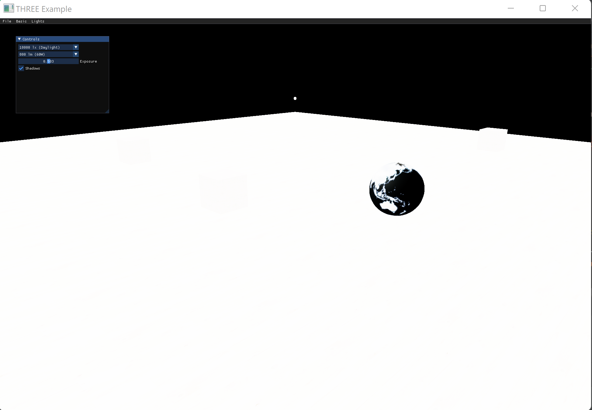

# 基于光源变化的PBR渲染

本文主要描述在PBR渲染方式下基于光源变化的光照效果，相关例子为three.js中的[webgl_lights_physcial](https://github.com/nintymiles/CGLearning)例子的C++移植版本。

本例子中的PBR渲染主要通过MeshStandardMaterial类实现，我们会简单窥探其背后的着色器实现。

## 地面、箱子和地球等模型的渲染
地面和箱子的模型比较简单，分别为平面和立方体。渲染时用到了多种纹理，分别为：漫射(diffuse)纹理、bump纹理和灰度(roughness)纹理，用以增强渲染的真实效果。
地球使用了球体几何体，借助了漫射纹理和金属(metalness)纹理映射。具体实现效果如下：


下面对three.js中针对不同纹理映射的着色器代码进行摘录：
### bump映射
bump映射，也是法线映射的一种，用于增强物体表面的深度细节或者高度信息。
```glsl
if defined( USE_BUMPMAP )
    
    // 获取纹理中的法线数据
	vec2 dHdxy_fwd() {

		vec2 dSTdx = dFdx( vUv );
		vec2 dSTdy = dFdy( vUv );

		float Hll = bumpScale * texture2D( bumpMap, vUv ).x;
		float dBx = bumpScale * texture2D( bumpMap, vUv + dSTdx ).x - Hll;
		float dBy = bumpScale * texture2D( bumpMap, vUv + dSTdy ).x - Hll;

		return vec2( dBx, dBy );

	}
    
    // 借助GPU对法线进行扰动
	vec3 perturbNormalArb( vec3 surf_pos, vec3 surf_norm, vec2 dHdxy, float faceDirection ) {

		// Workaround for Adreno 3XX dFd*( vec3 ) bug. See #9988

		vec3 vSigmaX = vec3( dFdx( surf_pos.x ), dFdx( surf_pos.y ), dFdx( surf_pos.z ) );
		vec3 vSigmaY = vec3( dFdy( surf_pos.x ), dFdy( surf_pos.y ), dFdy( surf_pos.z ) );
		vec3 vN = surf_norm;		// normalized

		vec3 R1 = cross( vSigmaY, vN );
		vec3 R2 = cross( vN, vSigmaX );

		float fDet = dot( vSigmaX, R1 ) * faceDirection;

		vec3 vGrad = sign( fDet ) * ( dHdxy.x * R1 + dHdxy.y * R2 );
		return normalize( abs( fDet ) * surf_norm - vGrad );

	}

    ...
    //使用gpu扰动后的法线
	normal = perturbNormalArb( - vViewPosition, normal, dHdxy_fwd(), faceDirection );
#endif

```

### 灰度纹理映射
灰度（即粗糙度）是指造成光漫射的表面不规则状况，反射方向根据表面粗糙度发生变化。
```glsl
//灰度纹理定义
uniform sampler2D roughnessMap;
float roughnessFactor = roughness;

#ifdef USE_ROUGHNESSMAP
    //获得对应的texel
	vec4 texelRoughness = texture2D( roughnessMap, vUv );

    //选取值并计算对应的灰度因子
	// reads channel G, compatible with a combined OcclusionRoughnessMetallic (RGB) texture
	roughnessFactor *= texelRoughness.g;

#endif
```

### 金属纹理映射
金属纹理映射类似灰度纹理映射。
```glsl
uniform sampler2D metalnessMap;
float metalnessFactor = metalness;

#ifdef USE_METALNESSMAP

	vec4 texelMetalness = texture2D( metalnessMap, vUv );

	// reads channel B, compatible with a combined OcclusionRoughnessMetallic (RGB) texture
	metalnessFactor *= texelMetalness.b;

#endif
```

## 不同的光源对PBR渲染效果的影响
本例使用了两种光源：点光源和外部环境光源。
当设置外部环境光源为月光，点光源分别为60W和100W的白炽灯时的对比效果

||   |
|:--------------------------|:--------------------------------|

当设置外部环境光源为日光，点光源无论设置多大瓦数的白炽灯，都已经对实际物体的渲染没有影响。如下图效果：



下面的代码展示了光源设置：
```c++
PointLight::sptr bulbLight;
HemisphereLight::sptr hemiLight;

...
//光源初始设置
bulbLight->add(Mesh::create( bulbGeometry, bulbMat ));
bulbLight->position.set( 0, 2, 0 );
bulbLight->castShadow = true;
scene->add( bulbLight );

hemiLight = HemisphereLight::create( 0xddeeff, 0x0f0e0d, 0.02 );
scene->add( hemiLight );

//切换外部光源环境和设置白炽灯瓦数时对应更改了相关的光强度设置
bulbLight->setPower(bulbLuminousPowers[bulbPowerSelIdx].second);
bulbMat->emissiveIntensity = bulbLight->intensity / math::pow( 0.02, 2.0 ); 

hemiLight->intensity = hemiLuminousIrradiances[hemiIrradianceSelIdx].second;

```

https://zhuanlan.zhihu.com/p/495561084
https://zhuanlan.zhihu.com/p/369178958